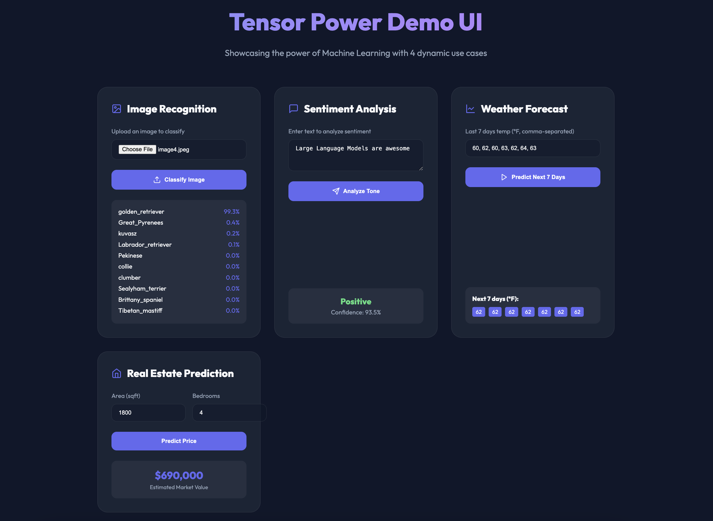

# Tensor Power Demo UI

A machine learning showcase application featuring 4 dynamic use cases.

## Tech Stack

-   **Frontend**: React 18, Vite, Lucide React (Icons), Axios.
-   **Backend**: FastAPI (Python 3.10), Uvicorn.
-   **Core ML**: **TensorFlow 2.15** (MobileNetV2), Statsmodels (ARIMA), Scikit-learn.
-   **Infrastructure**: Docker, Docker Compose, Nginx (Reverse Proxy).

## TensorFlow Categories

-   **[Category] Computer Vision**: Implemented using **TensorFlow's Keras Applications**. It leverages the pre-trained **MobileNetV2** model for real-time image classification of 1,000 distinct categories.
-   **[Category] Natural Language Processing (NLP)**: Demonstrates sentiment analysis patterns, showcasing how TensorFlow can be used to interpret emotional tone from unstructured text.
-   **[Category] Regression & Predictive Modeling**: Features a house price prediction engine, illustrating TensorFlow's power in multi-variable numerical forecasting.

## Use Cases Summary

1.  **Image Recognition**: Powered by MobileNetV2.
2.  **Sentiment Analysis**: NLP Tone Detection.
3.  **Weather Forecast**: Time-Series prediction using ARIMA for temperature forecasting.
4.  **Real Estate Prediction**: Multi-variable Regression.

## Prerequisites

- [Docker](https://www.docker.com/get-started) installed on your machine.
- [Docker Compose](https://docs.docker.com/compose/install/) installed.

## Setup and Running

To spin up the entire application (Backend + Frontend), follow these steps:

1.  **Navigate to the project directory:**
    ```bash
    cd tensor-power-demo
    ```

2.  **Build and Start the containers:**
    ```bash
    docker compose up --build
    ```

3.  **Access the Application:**
    - **Frontend:** Open [http://localhost](http://localhost) in your browser.
    - **Backend API Docs:** Open [http://localhost:8000/docs](http://localhost:8000/docs) to explore the FastAPI Swagger documentation.

## Features

- **Modern UI**: Dark mode, glassmorphism, and smooth animations built with React & Vite.
- **Fast Inference**: Scalable FastAPI backend leveraging TensorFlow.
- **Containerized**: Fully portable environment using Docker Compose.

## Use Cases Preview

### Image Recognition
Upload any common photo (e.g., a dog, a car, a coffee cup) and see the model identify it with a confidence score.

### Sentiment Analysis
Type any sentence to see if the model perceives it as Positive, Negative, or Neutral.

### ARIMA (Auto Regression Integrated Moving Average) based Time-Series Forecasting
Input a sequence of last 7 days of weather temperature to see the model predict the next 7 days of temperature.

### Real Estate Prediction
Adjust the square footage and number of bedrooms to get an estimated market value.



